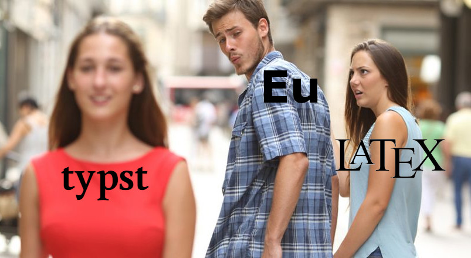

```{r}
devtools::load_all()
```

## Motivación

Esta viaxe comeza cunha solicitude aparentemente sinxela: Preparar unha nova paleta de cores para o Instituto.

Recordei inmediatamente un interesante artigo que tiña reservado para ler:

[Crameri, F., G.E. Shephard, and P.J. Heron (2020), *The misuse of colour in science communication*.](https://rdcu.be/b9lm1 "Fabio Crameri. The misuse of color in science communication")

Este resulta ser unha excelente porta de entrada a esta problemática ademáis de conducir a outras lecturas de grande utilidade.

## Primeiros pasos

A primeira conclusión rotunda é que a paleta --ou mapa-- de cores empregada na visualización de datos debe ser unha entidade separada da imaxe corporativa, dos elementos visuais da web, revistas, publicacións... Así e todo, pode buscarse unha harmonía entre ambas seleccións de cores.

A segunda e máis importante: As mapas de cores aplicadas aos datos deben ser científicas.

## Mapas de cores científicos

A presentación de datos científicos debe facerse sen introducir características ('features') artificiais ou eliminar detalles reais, ademáis de ser universalmente lexible. Non debe distorsionar os datos e ten que transmitir verazmente a realidade destes.

## Propiedades desexables

Polo tanto, unha paleta de cor axeitada para a difusión científica de datos --ou simplemente para unha comunicación visual **non distorsionada** de datos-- debe ter estas propiedades:

-   Uniformidade perceptual
-   Inclusividade das persoas con *deficiencias na percepción da cor*.
-   Orde perceptual
-   Lexibilidade en monocromo.
-   Reproducibilidade e Citabilidade.

## Scientific Colour Maps

Os anteriores principios materialízanse na colección coidadosamente elaborada de *Scientific Colour Maps* de Fabio Crameri. (`https://www.fabiocrameri.ch/colourmaps/`)

## Uniformidade Perceptual

Unha paleta **perceptualmente uniforme** pondera de xeito idéntico unha mesma variación en todo o espazo de datos.

As distancias entre puntos de datos e as cores correspondentes deben seguir unha proporción constante.

Pero, como medimos as distancias entre cores?

## Ferramentas para o estudo

Antes de continuar fagamos unha pausa para falar das ferramentas que imos precisas para seguir co estudo.

Precisaremos:

-   medicións desas distancias perceptuais das que falamos.
-   conversións entre espazos de cor.
-   representacións gráficas das paletas.
-   gráficos de exemplo empregando as paletas.
-   análise das canles de cor
-   evaluación matemática do 'erro visual' introducido polas distintas paletas de cor.

## Librarías de R útiles para o estudo dos mapas de cor

-   **`farver`**: Excelente set de ferramentas de conversión e manipulación.
-   **`pals`**:: Colección de paletas, principalmemente baseadas nas publicacións de **Peter Kovesi**, e utilidades de diagnose numérica e visual.
-   **`colorspace`**:: Colección de mapas de cor uniformes *no espazo HCL* e utilidades de conversión e diagnose. Destaca a simulación de 'CVDs' --Deficiencias da percepción da cor--

## Creando ferramentas propias

Os paquetes antes mencionados non proporcionan asi e todo unha forma de crear paletas uniformes desde cero, senon que proporcionan ferramentas para evalualas.

Tampoco contan con métodos para replicar as análises de Fabio Crameri nin facer algunhas das representacións visuais desexadas.

Polo tanto, para o desenvolvemento deste proxecto, comecei a escribir un sixelo paquete; moi rudimentario pero que simplifica o meu proceso exploratorio.

## A clase `ColorMap`

Despois de crear funcións de conversión, interpolación, etc., decateime de que non tiña a flexibilidade suficiente. Virei entón a definir unha clase `R6` como base.

As instancias desta clase, `ColorMap`, poden xenerarse a partires dun vector de códigos hexadecimais ou unha `matrix`, `data.frame` (ou `tibble`) de cores RGB ou LAB.

Con métodos para calcular as distancias e erro perceptuais, conversión e representación gráfica, facilitouse o meu fluxo de traballo significativamente.

<!-- [`unipals: https://github.com/jorsouben/uniform.palettes`](https://github.com/jorsouben/uniform.palettes) -->

## A peor paleta

:::: {.columns}

::: {.column width="45%"}
Posiblemente en mais dunha ocasión temos visto ou usado esta paleta:

```{r}
#| echo: TRUE
#| code-line-numbers: true
#| output-location: fragment

rbpal <- 
  rainbow(256) |>
  as_colormap()

rbpal$bands()
```
:::

::: {.column width="45%"}
::: fragment
ou a súa irmá 'jet':

```{r}
#| echo: TRUE
#| code-line-numbers: true
#| output-location: fragment
jetpal <- 
  jet_colors(256) |>
  as_colormap()

jetpal$bands()
```
:::
:::
::::

---

A primeira vista, o resultado pode parecer vistoso pola ampla gama cromática e cores intensas.

```{r}
#| echo: TRUE
#| code-line-numbers: true
#| fig-align: center
demoplot(jet_colors)
```

---

Pero, por poñer un exemplo, así o vería unha persoa con deuteranopia

```{r}
#| echo: TRUE
#| code-line-numbers: true
#| fig-align: center
demoplot(jet_colors, cvd = "deutan")
```

## `rainbow` e `jet`. Os seus problemas

Estas dúas paletas son a encarnación de todo o que non debe ter unha paleta axeitada para a representación científica de datos:

-   Non presentan uniformidade perceptual (como demostraremos máis adiante).
-   Non hai unha orde perceptual.
-   As flutuacións de luminosidade introducen falsas fronteiras ou características nos datos.
-   Non son accesibles a persoas con daltonismos.
-   Tampouco son lexibles en escala de grises.

---

Así se verían baixo as distintas deficiencias na percepción da cor

:::: {.columns}

::: {.column width="50%"}
```{r}
#| fig-cap: "`rainbow`"
rbpal$swatch(cvd = TRUE)
```
:::

::: {.column width="50%"}
```{r}
#| fig-cap: "`jet`"
jetpal$swatch(cvd = TRUE)
```
:::
::::

Volveremos despois a elas con demostracións máis 'dramáticas'

## Espazos de cor: RGB

O espazo RGB é un modelo de cor baseado na combinación de tres cores primarias de luz: vermello (Red), verde (Green) e azul (Blue). Cada cor represéntase como unha tripla de valores entre 0 e 255 ou 0 e 1, e é usado principalmente en pantallas e dispositivos dixitais para representar cores mediante luz.

## Espazos de cor: RGB. Un exemplo

:::: {.columns}
::: {.column width="40%"}
```{r}
#| echo: TRUE
#| code-line-numbers: true
  
pares <- matrix(
  c(
    30, 255,   0,
    10, 255,   0,
     0, 230, 255,
     0, 210, 255
  ),
  ncol = 3,
  byrow = TRUE
) |>
  as_colormap()
```
:::

::: {.fragment .column width="60%"}
```{r}
#| echo: TRUE
#| output-location: fragment

pares$bands()
```
:::

::::

Estes dous pares de cores están separados pola mesma distancia --euclídea--, 20 unidades no espazo RGB.

::: fragment
Pero baixo a nosa ollada o par azul diferenciase claramente mentres que os verdes son indiscernibles.
:::

## Espazos de cor: RGB

A distancia no espazo RGB non reflicte ben a percepción visual humana porque este modelo é lineal e técnico, mentres que a nosa visión é non lineal e sensitiva a certos cambios de cor máis que a outros.

**RGB non é perceptualmente uniforme**: Un cambio pequeno en RGB pode percibirse como moi grande ou moi pequeno dependendo da zona do espectro.

Por iso nunca debe usarse

``` r
colorRampPalette(vector_de_cores)
```

para definir unha paleta se pretendemos que sexa perceptualmente uniforme.

## Espazos de cor: HCL

O espazo de cor HCL (Hue, Chroma, Luminance) é un modelo deseñado para ser perceptualmente uniforme, que representa as cores segundo tres atributos que se corresponden coa percepción humana:

::: nonincremental
-   Hue (Matiz): tipo de cor (vermello, azul, verde…). É un ángulo.
-   Chroma (Croma): intensidade ou saturación da cor.
-   Luminance (Luminosidade): claridade ou escuridade da cor.
:::

## Espazos de cor: HCL. O paquete `colorspace`

O paquete `colorspace` enfócase na análise de mapas de cores no espazo HCL. Ofrece varias ferramentas que incorporei no meu fluxo de traballo así como unha colección de paletas uniformes **no espazo HCL**.

Estas paletas son boas opcións, pero non seguen exactamente os criterios dos "Scientific Colour Maps" dos que falaremos a continuación.

Asi e todo, aproveitaremos as paletas e utilidades deste paquete para explorar os tipos de paletas e as súas características.

## Tipos de mapas de cor

Segundo o tipo de datos a representar, as paletas poden ser:

-   **Continuas**. Idealmente definidas mediante fórmulas que permitan obter un número ilimitado de cores. Na práctica adoitan ser conxuntos dun gran número de cores que se interpolan.

-   **Discretas**. Na práctica van ser iguais que as continuas.

-   **Categóricas**. Para poder empregarse con efectividade o número de categorías debe ser baixo. A separación entre cores debe ser idealmente máxima para unha boa separación.

## Clases de mapas de cor

Nunha dimensión adicional diferencianse varias clases de paletas:

- **secuenciais**
- **diverxentes**, para amosar desviacións respecto dun valor de referencia
- **multisecuenciais**, para a comparación simultánea de varias categorías ou grupos, e
- **cíclicas**, axeitadas para datos periódicos, como a hora do día, a dirección de fluxos ou fases dun ciclo

## Exemplos: Paleta cualitativa

```{r}
#| fig-cap: "`colorspace` 'Harmonic'"
# colorspace::specplot(scico::scico(256, palette = "batlow"))
# colorspace::specplot(scico::scico(256, palette = "vik"))
colorspace::specplot(colorspace::qualitative_hcl(100, "Harmonic"))
```

## Exemplos: Paleta secuencial

```{r}
#| fig-cap: "`colorspace` 'Purple-Yellow'"
colorspace::specplot(colorspace::sequential_hcl(100, "Purple-Yellow"))
```
## Exemplos: Paleta diverxente

```{r}
#| fig-cap: "`colorspace` 'Vik'"
colorspace::specplot(colorspace::diverging_hcl(100, "Vik"))
```

## Exemplos: Paleta multisecuencial

```{r}
#| fig-cap: "`scico` 'bukavu'"
colorspace::specplot(scico::scico(100, palette = "bukavu"))
```

## Exemplos: Paleta cíclica

```{r}
#| fig-cap: "`scico` 'romaO'"
colorspace::specplot(scico::scico(16, palette = "romaO"))
```

## Orde perceptual

Despois destes exemplos é bo momento para falar da orde perceptual.

Esta ven determinada polo percorrido da paleta no espazo de cor e, especialmente pola luminosidade ou luminancia, que debe ser monótona e idealmente de pendente constante.

Unha paleta adecuada transmite a orde dos valores de xeito intuitivo, sen necesidade de consultar a lenda. 

## Espazos de cor: CIE Lab

O espazo CIELAB (CIE 1976 L\*, a\*, b\*) é un modelo tridimensional perceptualmente uniforme desenvolvido pola Comisión Internacional da Iluminación (CIE). Representa todas as cores visibles para o ollo humano mediante tres eixos:

## Espazos de cor: CIE Lab

:::::: columns
:::: {.column width="60%"}
::: nonincremental
-   L\**: luminosidade (de negro a branco, 0 a 100).*
-   *a\**: eixo verde-vermelho (valores negativos → verde, positivos → vermello).
-   *b\**: eixo azul-amarelo (valores negativos → azul, positivos → amarelo).
:::
::::

::: {.column width="40%"}
{.center}
:::
::::::

## Espazos de cor: CIE Lab

Este modelo é independente do dispositivo, o que permite comparar cores de forma consistente entre diferentes sistemas (pantallas, impresoras, etc.)

## Espazos de cor: CIE Lab. Medidas de distancia

O espazo Lab deseñouse para ser uniforme, definindo un "observador promedio" a partires de experimentos con persoas.

- CIE76: a fórmula orixinal para medir a distancia era simplemente a distancia euclidiana.

- CIEDE2000: Posteriormente desenvolveuse unha fórmula mellorada que incorpora correccións para representar mellor as diferenzas reais percibidas polo ollo humano.

## Scientific Colour Maps

Os 'Scientific Colour Maps' son unha colección de paletas deseñadas por Fabio Crameri, seguindo todos os principios que mencionamos inicialmente: uniformidade perceptual, accesibilidade, orde perceptual, ...

A diagnose destas realízase no espazo Lab, empregando principalmente a medida CIEDE2000.

Vexamos uns exemplos:

## *Scientific Colour Maps* "Batlow"

```{r}
#| echo: TRUE
diagnostic_plot(batlow_df)
```
## Matlab "jet"

```{r}
diagnostic_plot(jetpal)
```

## `R` "rainbow"

```{r}
diagnostic_plot(rainbow(256))
```

## "Batlow" e "rainbow" comparadas

```{r}
compare_diagnostics(batlow_df, rbpal, pal_names = c("batlow", "rainbow"))

```

## `viridis` e `plasma` baixo a lupa

```{r}
compare_diagnostics(
  viridisLite::viridis(256),
  viridisLite::plasma(256),
  pal_names = c("viridis", "plasma")
  )
```

## Erro perceptual na práctica

Para simular a distorsión inducida nos datos por un mapa de cor, creamos unha función `rescale_to_pal` que, empregando as distancias acumuladas e opcionalmente o signo da variación --dado pola variación na luminosidade--, reescala os datos en relación á distancia perceptual que lles otorga a paleta.

## `volcano` ca paleta `batlow`
:::: {.columns}

::: {.column width="30%"}
```{r}
#| fig-width: 6.1
#| fig-height: 8.6
#| fig-align: center
volcano_heatmap()
```
:::

::: {.column width="70%"}
```{r}
#| fig-width: 6.1
#| fig-height: 4.5
#| fig-align: center
volcano_3dplot()
```
:::

::::

## `volcano` ca paleta `jet`
:::: {.columns}

::: {.column width="30%"}
```{r}
#| fig-width: 6.1
#| fig-height: 8.6
#| fig-align: center
volcano_heatmap(pal = jetpal)
```
:::

::: {.column width="70%"}
```{r}
#| fig-width: 6.1
#| fig-height: 4.5
#| fig-align: center
volcano_3dplot(pal = jetpal)
```
:::

::::

## Creando unha paleta: Selección inicial de cores

Un dos requisitos iniciais ao deseñar unha paleta de cores para o IGE era incluír o *azul corporativo* da Xunta de Galicia.

Deseñar tan só un gradiente monocolor resulta aburrido, polo que engadimos dúas cores: un vermello similar ao presente na bandeira de Galicia e o vermello da Unión Europea.

```{r}
#| echo: TRUE
#| code-line-numbers: true
#| output-location: column-fragment

paleta <- 
igepal_hex |> 
  ColorMap$new()

paleta$bands()
```

## Creando unha paleta: Extendendo a gama

Pouco podemos facer con tan só tres cores, polo que tentaremos crear un gradiente entre elas.

Para iso, precisamos realizar dous procesos:

1. Extender o número de cores da paleta, mediante unha interpolación. Esta farase mediante *splines*.

2. Ecualizar as distancias secuenciais CIEDE2000 entre pares de cores consecutivas: Créanse moitos puntos intermedios por interpolación e búscase aqueles que resultan nunhas 'deltas' acumuladas o máis próximas posible ás ideais (diagonal perfecta).

## Interpolando no espazo Lab
```{r}
interp_lab <- 
  paleta |>
  map_resample(space = "lab", n_out = 256, ensure_fit = FALSE)

interp_lab |> 
  diagnostic_plot()
```

## Interpolando no espazo RGB
```{r}
interp_rgb <- 
  colorRampPalette(paleta$get_hex())(256)

interp_rgb |> 
  diagnostic_plot()
```
## Ecualizando

```{r}
#| echo: TRUE
#| code-line-numbers: true
#| fig-align: center

interp_rgb <- colorRampPalette(paleta$get_hex())(16)
ecualizada <- interp_rgb |> equalize(n = 256)
ecualizada |> diagnostic_plot()
```

## Resultado final?

```{r}
ecualizada$swatch(cvd = TRUE)
```

## Qué queda por facer?

- Maximizar o constraste de L, facendo a curva de pendente constante.

- Ecualizar de novo. Iterar

- Evitar vermello/verde na mesma paleta

- Observar a traxectoria no espazo 3D (parcialmente implementado), evitando traxectos 'enrevesados'

- A estos efectos, obter a compoñente principal da nube de puntos orixinal para asegurar unha traxectoria recta e unha L monótona.

## Conclusións

Aínda que os resultados son prometedores, conseguir elaborar métodos para construír unha paleta que cumpla cos criterios establecidos require aínda moito esforzo adicional.

Sen descartar seguir traballando neste proxecto, a recomendación actual é optar por empregar paletas de *Scientific Colour Maps*, accesibles en `R` a través do paquete `scico`.

Para o noso uso, incluso algunhas delas combinan perfectamente ca imaxe corporativa.

---
```{r}
scico::scico_palette_show()
```

---
```{r}
scipal <- function(pal = "batlow") {
  function(n) scico::scico(n, palette = pal)
}
demoplot(scipal()) + patchwork::plot_annotation("batlow")
```
---
```{r}
colmap <- "hawaii"

demoplot(scipal(colmap)) + patchwork::plot_annotation(colmap)
```

---
```{r}
colmap <- "davos"

demoplot(scipal(colmap)) + patchwork::plot_annotation(colmap)
```
---
```{r}
colmap <- "lapaz"

demoplot(scipal(colmap)) + patchwork::plot_annotation(colmap)
```

## Quarto e typst: alternativas a RMarkdown e $\LaTeX$

## Quarto: Por que dar o salto?

Quarto é a evolución natural de RMarkdown, con melloras en:

::: nonincremental
- Sintaxe máis limpa, melloras nas referencias a figuras, chunks, etc.

- Multilinguaxe: soporte nativo para R, Python, Julia, Observable JS… sen hacks.

- Outputs modernos: HTML, PDF, Word, Presentacións Reveal.js, libros, blogs… typst!. Todo dende o mesmo documento.
:::

## Quarto: vantaxes técnicas e de mantemento

::: nonincremental
- Modularidade e reutilización: chunks nomeados, macros, includes e variables globais.

- Integración con VS Code, Jupyter e Neovim: experiencia fluída fóra de RStudio.

- Proxectos organizados: quarto project permite xestionar múltiples documentos con configuración compartida.
:::

Documentación e comunidade en crecemento: soporte activo e exemplos actualizados.

## Falemos de $\LaTeX$

$\LaTeX$ é a opción de facto para converter documentos RMarkdown a PDF. E non sen boas razóns:

::: nonincremental
- Calidade tipográfica profesional: interletrado, xustificación, guións, fórmulas… todo impecable.

- Estándar académico: artigos, teses, libros… LaTeX é a lingua franca da publicación científica.

- Control absoluto: cada espazo, cada estilo, cada símbolo pode ser axustado ao milímetro.

- Sistema de composición intelixente: separación de contido e presentación… en teoría.
:::

## Onde falla LaTeX na súa propia promesa?

::: nonincremental
- Dependencia de estilos externos (.sty): cada clase redefine o que é `\section`, `\paragraph`, etc.

- Memoria técnica obrigatoria: ¿hai `\subsubsubsection` ou non? Depende do paquete.

- Configuración idiomática complexa: babel, polyglossia, inputenc, fontenc...
:::

## Onde falla LaTeX na súa propia promesa?

::: nonincremental
- Programar estilos é un pesadelo: `\renewcommand`, `\newenvironment`, `\makeatletter`...

- Formato infiltrado no contido: comandos como `\textbf`, `\vspace`, `\centering` aparecen por todas partes.
:::

## Podemos ter o mellor de $\LaTeX$ e Markdown nunha soa linguaxe?

::: nonincremental
- A calidade tipográfica de LaTeX

- A sinxeleza estrutural de Markdown

- A modularidade e estilo declarativo

- A reproducibilidade e internacionalización sen dor

- A personalización asequible
:::

## Typst



## Typst: Puntos chave

Typst busca unir a calidade tipográfica de LaTeX coa sinxeleza de Markdown.

::: nonincremental
- Linguaxe moderna e clara. Sintaxe limpa, intuitiva e declarativa, máis próxima a Markdown que a $\TeX$.

- Rapidez grazas a Rust. Compilación case instantánea, mesmo en documentos longos. Permite a previsualización en tempo real.

- Estilos programables sen dor. Sistema de estilos declarativo, con funcións e variables. Crear e modificar deseños é natural e asequible para o programador medio.
:::

## Typst: Puntos chave

::: nonincremental
- Internacionalización sinxela. Soporte nativo UTF-8. Para múltiples idiomas, sen a complexidade de babel ou polyglossia.

- Integración moderna. CLI sinxela, reproducibilidade en proxectos, integración con editores actuais.

- Ecosistema en crecemento. Comunidade activa, documentación clara, paquetes en expansión.
:::

## Un pequeno exemplo

```typst {fit=contain}
#set document(title: "Exemplo")

= Exemplo

+ Texto en *negrita*, _cursiva_, ou con #text(red)[cores]

+ Un rectángulo
  #rect()
  
+ Unha fórmula peculiar:

$ sum^pi_(🧠=1) #circle(radius: 4mm)/🥸 = #emoji.face.heart $

+ Unha táboa (Tomada da documentación de typst)

#import table: cell, header

#table(
  columns: 2,
  align: center,
  header(
    [*Trip progress*],
    [*Itinerary*],
  ),
  cell(
    align: right,
    fill: fuchsia.lighten(80%),
    [🚗],
  ),
  [Get in, folks!],
  [🚗], [Eat curbside hotdog],
  cell(align: left)[🌴🚗],
  cell(
    inset: 0.06em,
    text(1.62em)[🛖🌅🌊],
  ),
)
```
---


