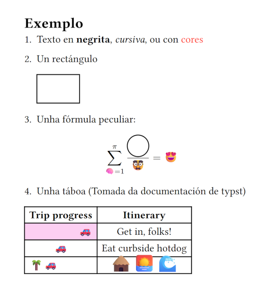

```{r}
devtools::load_all()
```

---

*Jordán Soubrier Benavides*

Instituto Galego de Estatística

{width=200}

## Motivación

Todo comeza cunha solicitude aparentemente sinxela: Preparar unha nova paleta de cores para o Instituto.

Primeira consideración:

- Elementos web, estéticos,... : seguirán criterios de imaxe corporativa.

- Representación de datos: debe seguir **criterios científicos**.

## Mapas de cores científicos

O mesmo rigor aplicado ao cálculo de datos científicos debería aplicarse á súa representación visual.

Unha das principais referencias actuais ao respecto son os *Scientific Colour Maps* de Fabio Crameri (`https://www.fabiocrameri.ch/colourmaps/`)

## Que é un mapa de cor científico

Aquel que non distorsiona os datos subxacentes.

Non introduce características artificiais nin obscurece os patróns realmente presentes nos datos.

Máis concretamente:

## Propiedades dunha paleta científica

Unha paleta de cor axeitada para a difusión científica de datos debe ter estas propiedades:

::: nonincremental
- **Uniformidade perceptual**.
- **Accesibilidade universal**: Inclusión das persoas con *deficiencias na percepción da cor*.
- **Orde perceptual**.
- **Lexibilidade en monocromo**.
- **Reproducibilidade e Citabilidade**.
:::

## Uniformidade Perceptual

Unha paleta é **perceptualmente uniforme** se a distancias percibidas entre cores correspóndense cas distancias entre valores representados, de xeito uniforme, en todo o espazo.

## Espazos de cor: RGB

O espazo RGB é un modelo de cor que combina luz vermella, verde e azul para representar cores en pantallas dixitais.

## Espazos de cor: RGB. Un exemplo

:::: {.columns}
::: {.column width="40%"}
```{r}
#| echo: TRUE
#| code-line-numbers: true

pares <- matrix(
  c(
    30, 255, 0,
    10, 255, 0,
    0, 230, 255,
    0, 210, 255
  ),
  ncol = 3,
  byrow = TRUE
) |>
  as_colormap()
```
:::

::: {.fragment .column width="60%"}
```{r}
#| echo: TRUE
#| output-location: fragment

pares$bands()
```
:::

::::

Estes dous pares de cores están separados pola mesma distancia --euclídea--, 20 unidades no espazo RGB.

::: fragment
Pero baixo a nosa ollada o par azul diferenciase claramente mentres que os verdes son indiscernibles.
:::

## Espazos de cor: RGB

O espazo RGB é lineal e técnico. Non reflicte ben a percepción visual humana porque esta ten distintas sensibilidades á diferentes frecuencias do espectro lumínico.

**RGB non é perceptualmente uniforme**

Por iso nunca debe usarse

``` r
colorRampPalette(vector_de_cores)
```

para definir unha paleta se pretendemos que sexa perceptualmente uniforme.

## Librarías de R útiles para o estudo dos mapas de cor

-   **`farver`**: Excelente set de ferramentas de conversión e manipulación.
-   **`pals`**:: Colección de paletas, principalmemente baseadas nas publicacións de **Peter Kovesi**, e utilidades de diagnose numérica e visual.
-   **`colorspace`**:: Colección de mapas de cor uniformes *no espazo HCL* e utilidades de conversión e diagnose. Destaca a simulación de 'CVDs' --Deficiencias da percepción da cor--

## Ferramentas propias

Para traballar na creación e dunha potencial paleta científica, replicando as diagnoses de *Scientific Colour Maps*, foi preciso programar numerosos métodos que, xunto a algunhas funcións das anteriores librarías, foron integradas nunha clase R6.

Isto fixo o fluxo de traballo máis doado e flexible.

[`unipals: https://github.com/jorsouben/uniform.palettes`](https://github.com/jorsouben/uniform.palettes)

## Espazos de cor: HCL

::: nonincremental
- Deseñado para ser perceptualmente uniforme.
- Coordenadas cilíndricas. 3 atributos relacionados ca percepción humana:
- Hue (*Matiz*): tipo de cor (vermello, azul, verde…). (ángulo).
- Chroma (*Croma*): intensidade ou saturación da cor. (distancia)
- Luminance (*Luminosidade*): claridade ou escuridade da cor.
:::

## Espazos de cor: HCL. O paquete `colorspace`

O paquete `colorspace` enfócase na análise de mapas de cores no espazo HCL.

<!-- As súas paletas son boas opcións, pero non seguen exactamente os criterios dos "Scientific Colour Maps". -->

Aproveitaremos as paletas e utilidades deste paquete para explorar os tipos e clase de paletas e as súas características.

## Tipos de mapas de cor

Segundo o tipo de datos a representar, as paletas poden ser:

- **Continuas**. Idealmente definidas mediante fórmulas que permitan obter un número ilimitado de cores. Na práctica adoitan ser conxuntos dun gran número de cores que se interpolan.
- **Discretas**. Na práctica van ser iguais que as continuas.
- **Categóricas**. Para poder empregarse con efectividade o número de categorías debe ser baixo. A distancia entre cores debería ser máxima para unha boa separación.

## Clases de mapas de cor

<!-- Nunha dimensión adicional diferencianse varias clases de paletas: -->

::: nonincremental
- **secuenciais**, datos nun intervalo con valores mínimo e máximo.
- **diverxentes**, para amosar desviacións respecto dun valor de referencia.
- **multisecuenciais**, para a comparación simultánea de varias categorías ou grupos, e
- **cíclicas**, axeitadas para datos periódicos, como a dirección de fluxos ou fases dun ciclo
:::

## Exemplos: Paleta cualitativa

```{r}
#| fig-cap: "`colorspace` 'Harmonic'"
colorspace::specplot(colorspace::qualitative_hcl(100, "Harmonic"))
```

## Exemplos: Paleta secuencial

```{r}
#| fig-cap: "`colorspace` 'Purple-Yellow'"
colorspace::specplot(colorspace::sequential_hcl(100, "Purple-Yellow"))
```
## Exemplos: Paleta diverxente

```{r}
#| fig-cap: "`colorspace` 'Vik'"
colorspace::specplot(colorspace::diverging_hcl(100, "Vik"))
```

## Exemplos: Paleta multisecuencial

```{r}
#| fig-cap: "`scico` 'bukavu'"
colorspace::specplot(scico::scico(100, palette = "bukavu"))
```

## Exemplos: Paleta cíclica

```{r}
#| fig-cap: "`scico` 'romaO'"
colorspace::specplot(scico::scico(16, palette = "romaO"))
```

## Orde perceptual

Unha paleta adecuada permite xulgar a orde dos valores de xeito intuitivo, sen necesidade de consultar unha lenda. 

Esta orde perceptual ven determinada por:

- Percorrido suave da paleta no espazo de cor e, especialmente,
- **Luminancia**, que debe ser **monótona** e *idealmente de pendente constante*.

## Espazos de cor: CIE Lab

O espazo CIELAB (CIE 1976 L\*, a\*, b\*) é un modelo tridimensional perceptualmente uniforme desenvolvido pola Comisión Internacional da Iluminación (CIE). Representa as cores visibles para o ollo humano mediante tres eixos:

## Espazos de cor: CIE Lab

:::::: columns
:::: {.column width="60%"}
::: nonincremental
- *L\**: luminosidade* (de negro a branco, 0 a 100).
- *a\**: eixo verde(-) - vermello(+)
- *b\**: eixo azul(-) - amarelo(+)
:::

Este modelo é independente do dispositivo, o que permite comparar cores de forma consistente entre diferentes sistemas (pantallas, impresoras, etc.)

::::

::: {.column width="40%"}
{.center}
:::

::::::

## Espazos de cor: CIE Lab. Medidas de distancia

O espazo Lab deseñouse para ser uniforme, definindo un "observador promedio" a partires de experimentos con persoas.

- CIE76: a fórmula orixinal para medir a distancia era simplemente a distancia euclidiana.

- CIEDE2000: Posteriormente desenvolveuse unha fórmula mellorada que incorpora correccións para representar mellor as diferenzas reais percibidas polo ollo humano.

## Scientific Colour Maps

Os *Scientific Colour Maps* son unha colección de paletas deseñadas por Fabio Crameri, seguindo todos os principios que mencionamos inicialmente: uniformidade perceptual, accesibilidade universal, ...

A diagnose destas realízase no espazo Lab, empregando principalmente a medida CIEDE2000.

Vexamos uns exemplos:

## *Scientific Colour Maps* "Batlow"

```{r}
#| echo: TRUE
diagnostic_plot(batlow_df)
```
## Matlab "jet"

```{r}
jetpal <-
  jet_colors(256) |>
  as_colormap()
diagnostic_plot(jetpal)
```

## `R` "rainbow"

```{r}
diagnostic_plot(rainbow(256))
```

## "Batlow" e "rainbow" comparadas

```{r}
rbpal <-
  rainbow(256) |>
  as_colormap()
compare_diagnostics(batlow_df, rbpal, pal_names = c("batlow", "rainbow"))
```

## `rainbow` e `jet`. As peores paletas

Estas dúas paletas encarnan a antítese do que debe ser unha paleta científica:

-   Non presentan uniformidade perceptual.
-   Non hai unha orde perceptual.
-   As flutuacións de luminosidade introducen falsas fronteiras ou características nos datos.
-   Non son accesibles a persoas con DPCs.
-   Tampouco son lexibles en escala de grises.

---

Así veríanse baixo as distintas deficiencias na percepción da cor

:::: {.columns}

::: {.column width="50%"}
```{r}
#| fig-cap: "`rainbow`"
rbpal$swatch(cvd = TRUE)
```
:::

::: {.column width="50%"}
```{r}
#| fig-cap: "`jet`"
jetpal$swatch(cvd = TRUE)
```
:::
::::

## `viridis` e `plasma` baixo a lupa

```{r}
compare_diagnostics(
  viridisLite::viridis(256),
  viridisLite::plasma(256),
  pal_names = c("viridis", "plasma")
)
```

## Erro perceptual na práctica

A distancia perceptual ciede2000 é sempre positiva, así coma o erro visual, que se mide en valor absoluto.

Pero como vimos, o sentido e monotonía da L é a principal responsable da orde perceptual; sinala o sentido en que varían os datos.

Incorporando ambos elementos e rescalando os datos orixinais para reflectir a distorsión, obtemos una visualización moi reveladora.

## `volcano` ca paleta `batlow`
:::: {.columns}

::: {.column width="30%"}
```{r}
#| fig-width: 6.1
#| fig-height: 8.6
#| fig-align: center
volcano_heatmap()
```
:::

::: {.column width="70%"}
```{r}
#| fig-width: 6.1
#| fig-height: 4.5
#| fig-align: center
volcano_3dplot()
```
:::

::::

## `volcano` ca paleta `jet`
:::: {.columns}

::: {.column width="30%"}
```{r}
#| fig-width: 6.1
#| fig-height: 8.6
#| fig-align: center
volcano_heatmap(pal = jetpal)
```
:::

::: {.column width="70%"}
```{r}
#| fig-width: 6.1
#| fig-height: 4.5
#| fig-align: center
volcano_3dplot(pal = jetpal)
```
:::

::::

## Creando unha paleta: Selección inicial de cores

A idea inicial inicial ao deseñar unha paleta para o IGE era incluír o *azul corporativo* da Xunta de Galicia.

A este engadímoslle duas cores contrastadas:

```{r}
#| echo: TRUE
#| code-line-numbers: true
#| output-location: column-fragment

paleta <-
  igepal_hex |>
  ColorMap$new()

paleta$bands()
```

## Ampliando a paleta

Pouco podemos facer con tan só tres cores, polo que tentaremos crear un gradiente entre elas.

Para iso, precisamos realizar dous procesos:

1. *Extender* o número de cores da paleta, mediante unha interpolación. Esta farase mediante *splines*.

2. **Ecualizar** as distancias secuenciais CIEDE2000 entre pares de cores consecutivas: Interpolamos en miles de puntos intermedios, calculamos as distancias e seleccionamos aqueles que aseguran un reparto equitativo da distancia acumulada total.

## Interpolando no espazo Lab
```{r}
interp_lab <-
  paleta |>
  map_resample(space = "lab", n_out = 256, ensure_fit = FALSE)

interp_lab |>
  diagnostic_plot()
```

## Interpolando no espazo RGB
```{r}
interp_rgb <-
  colorRampPalette(paleta$get_hex())(256)

interp_rgb |>
  diagnostic_plot()
```
## Ecualizando

```{r}
#| echo: TRUE
#| code-line-numbers: true
#| fig-align: center

interp_rgb <- colorRampPalette(paleta$get_hex())(16)
ecualizada <- interp_rgb |> equalize(n = 256)
ecualizada |> diagnostic_plot()
```

## Resultado final?

```{r}
ecualizada$swatch(cvd = TRUE)
```

## Qué queda por facer?

- Maximizar o constraste de L, facendo a curva de pendente constante.

- Ecualizar de novo. Iterar

- Evitar vermello/verde na mesma paleta

- Observar a traxectoria no espazo 3D, buscando ter traxectos suaves.

- A estos efectos, unha idea e obter a compoñente principal da nube de puntos orixinal para asegurar unha traxectoria recta e unha L monótona.

## Conclusións

Aínda que os resultados son prometedores, conseguir elaborar métodos para construír unha paleta que cumpla cos criterios establecidos require aínda moito esforzo adicional.

Sen descartar seguir traballando neste proxecto, a recomendación actual é optar por empregar paletas de *Scientific Colour Maps*, accesibles en `R` a través do paquete `scico`.

Para o noso uso, incluso algunhas delas combinan perfectamente ca imaxe corporativa.

---
```{r}
scico::scico_palette_show()
```

---
```{r}
scipal <- function(pal = "batlow") {
  function(n) scico::scico(n, palette = pal)
}
demoplot(scipal()) + patchwork::plot_annotation("batlow")
```
---
```{r}
colmap <- "hawaii"

demoplot(scipal(colmap)) + patchwork::plot_annotation(colmap)
```

---
```{r}
colmap <- "davos"

demoplot(scipal(colmap)) + patchwork::plot_annotation(colmap)
```
---
```{r}
colmap <- "lapaz"

demoplot(scipal(colmap)) + patchwork::plot_annotation(colmap)
```

## Quarto e typst: alternativas a RMarkdown e LaTeX

## Quarto: Por que dar o salto?

Quarto é a evolución natural de RMarkdown:

::: nonincremental
- Sintaxe máis limpa, mellores referencias, máis personalización.
- Multilinguaxe: soporte nativo para R, Python, Julia, Observable JS
- Outputs modernos: HTML, PDF, Word, Presentacións Reveal.js, libros, blogs… typst!. Todo dende o mesmo documento.
:::

## Quarto: vantaxes técnicas e de mantemento

::: nonincremental

- Integración con VS Code, Jupyter e Neovim: non dependencia de RStudio.

- Documentación e comunidade en crecemento, mentres que o desenvolvemento de RMarkdown está en declive.

:::
## Falemos de LaTeX

LaTeX é o motor de facto para converter documentos RMarkdown a PDF. E non sen boas razóns:

::: nonincremental
- Calidade tipográfica insuperable.
- Estándar académico desde fai décadas.
- Escritura matemática.
- Separación de contido, estrututa e presentación… en teoría.
:::

## Onde falla LaTeX na súa propia promesa?

::: nonincremental
- Dependencia de estilos externos (.sty)
- Dificultade de personalización.
- Configuración idiomática, dependencias, ...
- Erros de compilación pouco informativos.
:::

## Podemos ter o mellor de LaTeX e Markdown nunha soa linguaxe?

::: nonincremental
- A calidade tipográfica de LaTeX

- A sinxeleza estrutural de Markdown

- Unha personalización asequible
:::

## Typst

Busca (e logra con creces) acadar esta combinación.

::: nonincremental
- Sintaxe básica moi similar a Markdown.
- Linguaxe de programación moderna, clara e moi potente.
- 100% UTF-8
- Erros de compilación moi informativos.
- Compilación case instantánea. Permite a previsualización en tempo real.
:::

## Un pequeno exemplo

```typst {fit=contain}
#set document(title: "Exemplo")

= Exemplo

+ Texto en *negrita*, _cursiva_, ou con #text(red)[cores]

+ Un rectángulo
  #rect()
  
+ Unha fórmula peculiar:

$ sum^pi_(🧠=1) #circle(radius: 4mm)/🥸 = #emoji.face.heart $

+ Unha táboa (Tomada da documentación de typst)

#import table: cell, header

#table(
  columns: 2,
  align: center,
  header(
    [*Trip progress*],
    [*Itinerary*],
  ),
  cell(
    align: right,
    fill: fuchsia.lighten(80%),
    [🚗],
  ),
  [Get in, folks!],
  [🚗], [Eat curbside hotdog],
  cell(align: left)[🌴🚗],
  cell(
    inset: 0.06em,
    text(1.62em)[🛖🌅🌊],
  ),
)
```
---



